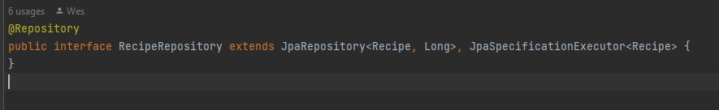
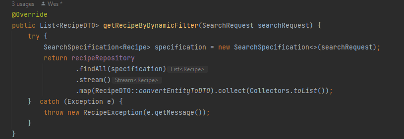
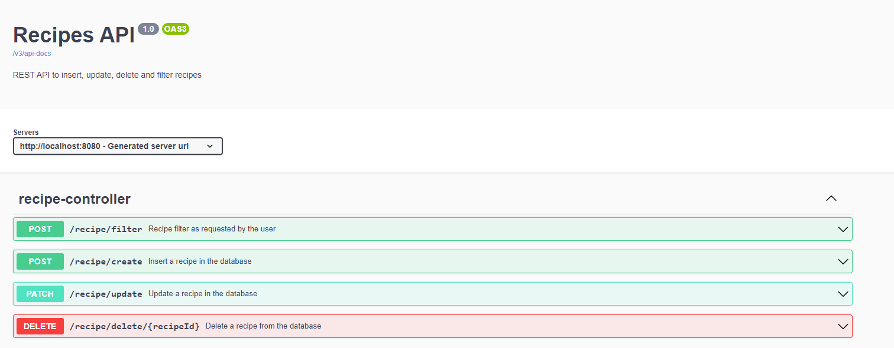
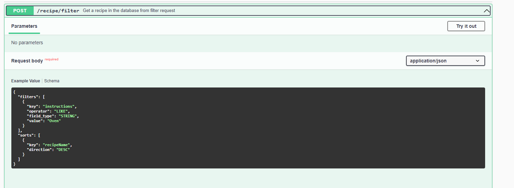
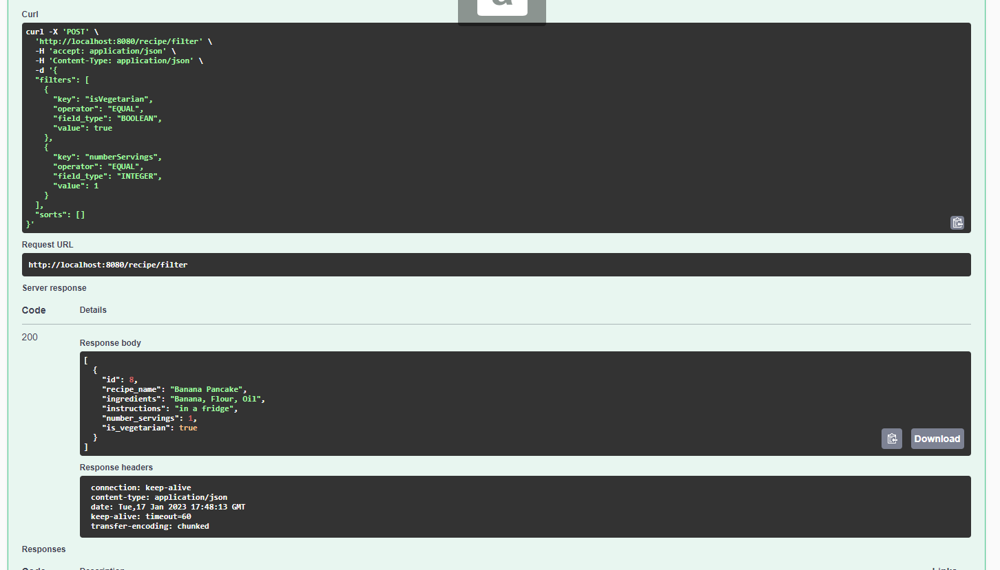
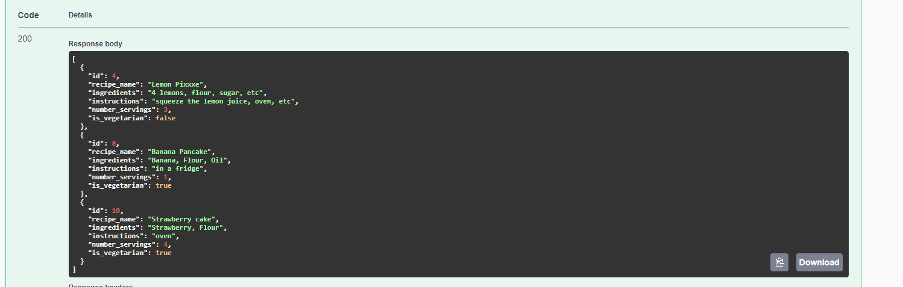
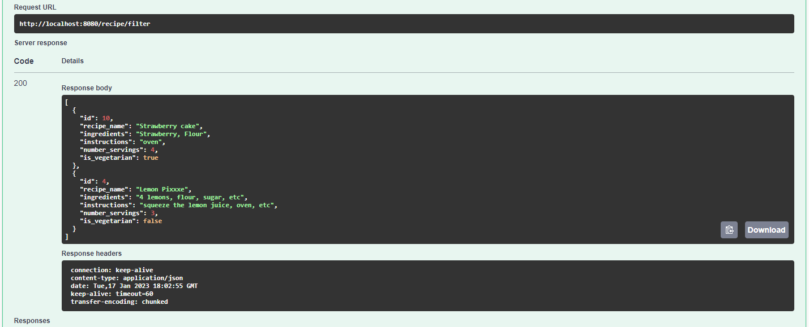
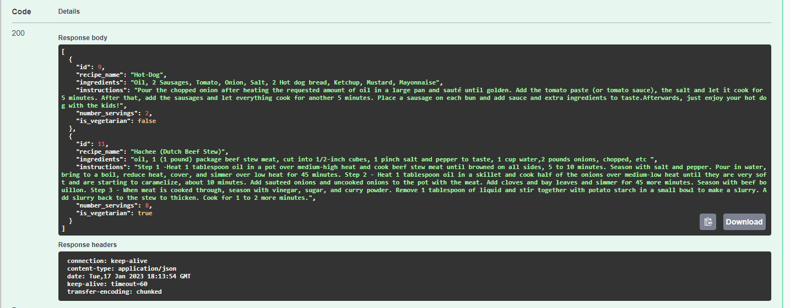

# Recipes

This is a Recipe application which allows the user to manage their favourite recipes.
The user is allowed to add, update, remove and filter recipes. 
The cool thing is that the filter works dynamically!! For that I used Spring Data JPA Specification.
With JPA specification I don't need to write queries or implement get methods in the repository, as you can see my repository is clean:

And the implementation of the filter in service class:



I implemented it with Spring Boot, Spring Data, Lombok, PostgreSQL Driver and H2 Database for the integration test
Java SDK version 19.

I used a PostgreSQL database to persist the information and H2 database to run the integration test.

To run locally you need to configure the database - Postgresql
Create the database in Postgresql with the name: recipes_abn_amro

Add configuration application-local.properties file like following below.

# Database
```
#spring.jpa.database=POSTGRESQL
spring.datasource.url=jdbc:postgresql://localhost:5432/recipes_abn_amro
spring.datasource.username=postgres
spring.datasource.password=admin
spring.jpa.hibernate.ddl-auto=update
spring.jpa.generate-ddl=true
spring.jpa.properties.hibernate.jdbc.lob.non_contexual_creation=true
spring.jpa.properties.jakarta.persistence.sharedCache.mode=NONE
```
UserName and Password can be used as according to your configuration of the PostgreSQL server. 
For my configuration I used the default username and password.

You can execute/run the project with Spring Boot

After running the application you can check the REST API documentation here: http://localhost:8080/swagger-ui/index.html


Here you can check all the rest endpoints for:
Create a recipe
Update a recipe
Delete a recipe
And filter the recipe. 

For the filtering I will explain how to use it
As you can see the request data for filter is:


The filter works dynamically, the request can be any field of the recipe entity taking into account some factors:
You can filter the recipe entity using its columns name of the entity and some supported operations. 
Ex: I want to filter all the recipe that is Vegetarian and the Number of servings is 1. 

It will receive a SearchRequest Object with the following data:
```
{
    "filters": [
        {
            "key": "isVegetarian",
            "operator": "EQUAL",
            "field_type": "BOOLEAN",
            "value": true
        },
       {
            "key": "numberServings",
            "operator": "EQUAL",
            "field_type": "INTEGER",
            "value": 1
        },
    ],
    "sorts": []
}
```
The result:


```
[
  {
    "id": 8,
    "recipe_name": "Banana Pancake",
    "ingredients": "Banana, Flour, Oil",
    "instructions": "in a fridge",
    "number_servings": 1,
    "is_vegetarian": true
  }
]
```



You can send a list of filters within each key the recipe entity names:
For a future implementation you can just add the new column in the recipe entity and don't have to write any more code or create a new filter request.
Specification is really a cool thing.
```
Key names: recipeName, ingredients, instructions, numberServings and isVegetarian.
```

```
Field_type supported: BOOLEAN, CHAR, DATE, DOUBLE, INTEGER, LONG, and STRING.
```

```
Operator supported: EQUAL, NOT_EQUAL, LIKE, NOT_LIKE, IN, NOT_IN, BETWEEN.
```

You can also Sort the results! Using the sort object in the Filter request:

```
{
    "filters": [
        {
            "key": "isVegetarian",
            "operator": "EQUAL",
            "field_type": "BOOLEAN",
            "value": true
        },
       {
            "key": "numberServings",
            "operator": "EQUAL",
            "field_type": "INTEGER",
            "value": 1
        },
    ],
    "sorts": [
    {
      "key": "recipeName",
      "direction": "DESC"
    }
  ]
}
```
Where Key is the entity(column) name to be sorted. You can sort ASC or DESC.

For the operator field:

I want to filter recipe that has flour in the ingredients description
LIKE
```
{
  "filters": [
    {
      "key": "ingredients",
      "operator": "LIKE",
      "field_type": "STRING",
      "value": "flour"
    }
  ],
  "sorts": [
    {
      "key": "id",
      "direction": "ASC"
    }
  ]
}
```
The result:


I want to filter recipe that has flour in the ingredients description and has "Oven" in the instructions:
```
{
  "filters": [
    {
      "key": "instructions",
      "operator": "LIKE",
      "field_type": "STRING",
      "value": "Oven"
    },
    {
      "key": "ingredients",
      "operator": "LIKE",
      "field_type": "STRING",
      "value": "flour"
    }
  ],
  "sorts": [
    {
      "key": "recipeName",
      "direction": "DESC"
    }
  ]
}
```
The result:


Oh now I want to filter the recipes which use oil in the instructions, but I don't want to use flour and have up to 1 to 4 servings!

I want to filter recipe that has flour in the ingredients description and has "Oven" in the instructions:
```
{
  "filters": [
    {
      "key": "ingredients",
      "operator": "NOT_LIKE",
      "field_type": "STRING",
      "value": "flour"
    },
		  {
      "key": "instructions",
      "operator": "LIKE",
      "field_type": "STRING",
      "value": "oil"
    },
			  {
      "key": "numberServings",
      "operator": "BETWEEN",
      "field_type": "INTEGER",
      "value": 1,
	  "value_to":8
    }
  ],
  "sorts": [
  ]
}
```




Any other doubts of how to use it, please send me a message :D 